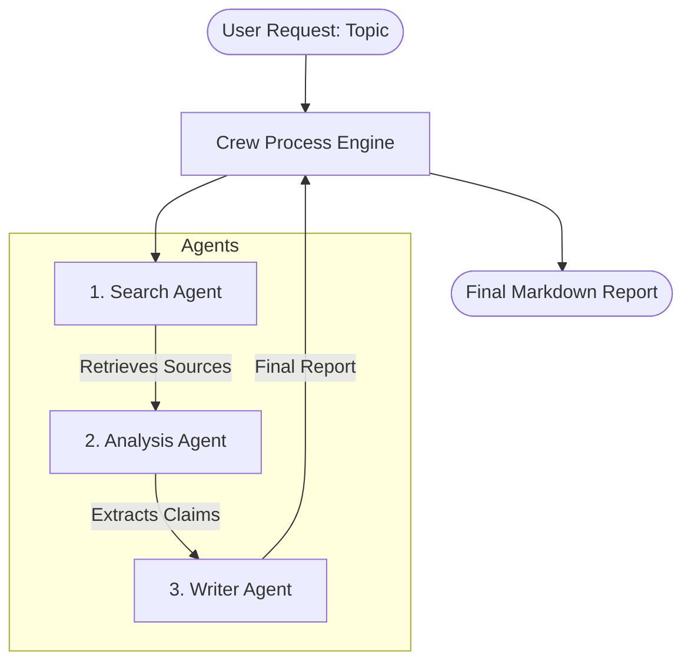

# Architecture: Research Assistant Crew
> Maturity: Functional Prototype

This project utilizes a multi-agent orchestration architecture powered by **CrewAI**.

## Flow Diagram

## Design Decisions

### 1. Sequential Hand-Off
We chose CrewAI's `sequential` process model. This forces a strict hub-and-spoke pipeline where the output of one agent becomes the context for the next. This prevents infinite loops or agents talking over each other.

### 2. Separation of Concerns (Role Design)
- **Search Agent (Data Gathering)**: Exclusively has access to the `DuckDuckGoSearchRun` tool. We disabled delegation (`allow_delegation=False`) to prevent the Search Agent from handing off incomplete searches to other agents.
- **Analysis Agent (Data Extraction)**: Has no external tools. Its sole responsibility is reasoning over the Search Agent's output. By isolating this, we force the LLM to focus purely on validation and extraction, improving claim accuracy.
- **Writer Agent (Synthesis)**: Only receives the extracted claims, not the raw search data. This prevents the Writer from "hallucinating" facts that the Analyst didn't explicitly verify.

### 3. Agent Backstories
Giving each agent a distinct persona and explicit constraints (e.g., "you never merge two sources' claims into one without saying so") is what prevents CrewAI agents from blending into one generic voice. The constraints are defined in `src/agents.py`.
